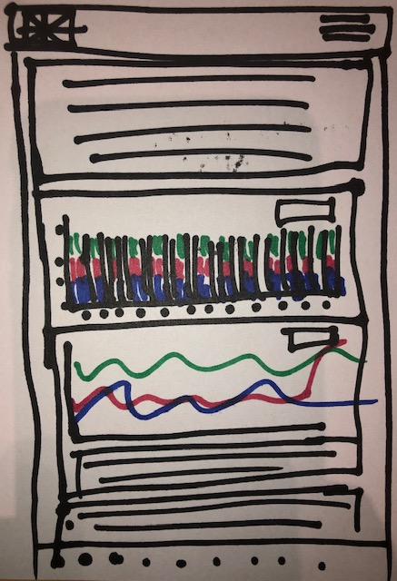
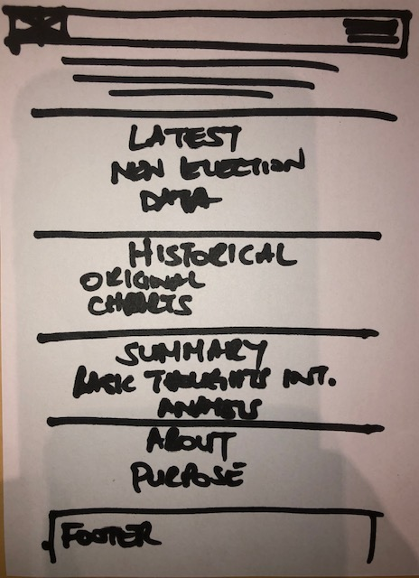
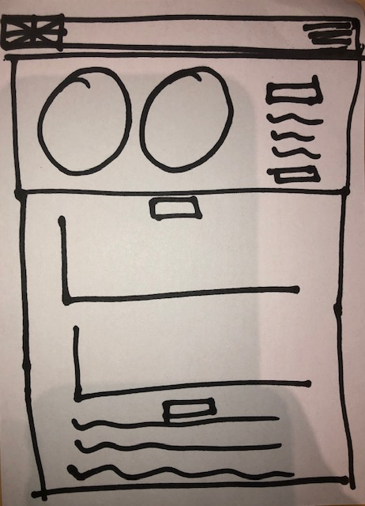

### Milestone Project 2 - Code Institute Software Development Diploma

### Interactive Front End Development

# A Century of Great Britain's Voting Bias

The aim of this project was to create a dashboard style blog with a visual representation of voting bias over the past century, using a presentation of known results, to see whether there was any noticeable correlation with historical events which may have played a role in swaying votes in a particular direction and how if at all it affected the distribution of seats in parliament.

More specifically, I wanted to see whether any ordinary person who isn't an expert on the topic, would be able to distinguish any relational patterns when cognitive analysis was replaced by visual perception.

### Table of Contents

1. [UX](#ux)

   - [Project Goals](#project-goals)
   - [User Stories](#user-stories)

2. [Features](#features)

   - [Charts](#charts)
     - [2019 Results](#2019-results)
     - [Historical Results](#historical-results)
     - [Select Menu](#select-menu)
   - [Summary](#summary)
   - [About](#about)
   - [Final Comment](#final-comment)
   - [Sources](#sources)

3. [Improvements to implement](#improvements-to-implement)

4. [Technologies Used](#technologies-used)

   - [Programming Languages](#programming-languages)
   - [Frameworks](#frameworks)
   - [Toolkits](#toolkits)
   - [Libraries](#libraries)

5. [Testing](#testing)

6. [Deployment](#deployment)

   - [Process](#process)
   - [Process to run the project locally](#process-to-run-the-project-locally)

7. [Credits](#credits)
8. [Media](#media)
9. [Acknowledgements](#acknowledgments)
10. [Inspiration](#inspiration)
11. [Wireframes](#wirefames)

## UX

### Project Goals

My intention for the User Experience was to ensure that the site works on both mobile or desktop. Whilst a dashboard is more suited to a desktop sized screen, I focussed on balancing the size of the individual graphs such that they would be visible without being too small or too big on each media type, taking cognisance of the gesture capability on touchscreens. [DC.js has a method](https://dc-js.github.io/dc.js/docs/html/BaseMixin.html#useViewBoxResizing__anchor) that uses the `<svg>` element rather than chart `width` and `height` attributes, enabling the chart to resize responsively, whilst maintaining the aspect ratio, which helped me to achieve this. My aim was have to make the site appealing to the users; presenting the data in a way that is unambiguous so that they become engaged in their analysis. Additionally, I have endeavoured to create a site that is aesthetically pleasing through the use of colour, typography and layout using [Bootstrap4](https://getbootstrap.com/) and [Bootwatch Themes](https://bootswatch.com/)

### User Stories

**_User: 1 - As a user interested in the election results, I want to be able to examine the data visually rather than from a text format so that I can absorb the results more efficiently. I want to be able to interact with the data by filtering it to for analysis and comparison._**

**_User: 2 - As a user interested in the general history of the UK elections I want to be able to view a time-line of the results. In a graph I can gain a clearer perspective and be able to absorb more data at once and I would easily to see the changes over time._**

_I have specifically selected charts that I feel best represent the data type to assist both types of users to achieve their goals. Pie Charts are ideal for illustrating parts of a whole. A Bubble Chart effectively provides a multidemensional visualisation enabling users to see relationships and anomalies in the data. I chose these charts for the latest election results as they didn't have a year dimension._

_The Historical Charts display a much larger dataset. The different dimensions are presented in separate charts. The `select menu` for this sub-section allows the users to interact with the charts by filtering the data to a single party over the period of a century, facilitating quick analysis of the data._

_To enable the users to easily refresh the charts I have placed a refresh `<button>` in close proximity to the indivudual chart sub-sections to aid further inquiry and analysis._

_For User 1, I have strategically placed a `<button>` beneath the charts for the users to naviagte back to the top. It is possible that this type of user may not be interested in the blog text. However, should they wish to peruse relevant data sources, once they are back at the top, they can easily do so via the `Sources link` in the `<Nav>`._

_All data sources and additional resources I used are found in the `<footer>` section where again, they will find a duplicate `<button>` to help users navigate back to the charts (via the `<nav>`)should they so desire._

_For user 2, I have written a summary, detailing a small amount of supplementary information and personal analysis. I also added additional reading resources to assist the user to gain broader perspecive on the UK Elections adding Icons and Tooltips in the `<Footer>` provide additional visual guidance so they can be quickly scanned for relevance by each user type._

## Features

### Charts

The main features of this project are the graphs. There are five graphs to illustrate the two different datasets covering the latest results and the historical results. The former being an addition that became relevant during development.

#### 2019 Results

For the latest election results charts, there are 2 Pie Charts and a Bubble chart. The Pie Charts refer to the votes and seats results respectively and the Bubble Chart collates the data presented in each Pie Chart and provides a comparison. It was included to elaborate the “first past the post” voting system that the UK adopts, essentially to see how disparate the votes to seats figures are.

#### Historical Results

A Stacked Bar Chart and Composite Chart display the full results for past century of the votes and seats results respectively, for each party. The intention for these charts was to show how the individual party’s fared in respect of their competition in order to highlight periods of strength and/or weakness. I had particularly hope to see whether there was a pattern associated to historical events. N.B. These charts make it possible to do so and I am continuing research on this aspect of my inquiry and intend to document my conclusion at a later date.

#### Select Menu

It was ideal to have a `Select Menu` for each chart section. For the 2019 election section I added in a range dimension to the dataset to make the `Select Menu` viable. I could already assume an irregularity in the Pie Charts as I had noted a similarity in the historical charts. I needed the `Select Menu` so that I could analyse the relationship (if any) between the number of seats won in comparison to the votes received. Prior to the seeing the charts for myself I had not known of the “first past the post voting system” and it was a lucky reveal. I received help in this aspect from a CI tutor who suggested that a range dimension would solve my problem as a simple party dimension wasn’t providing the selection I needed for my analysis.
The `Select Menu` for the historical charts are a simple isolation of other parties data. Although the data set spans a century, there are far fewer registered parties than during the 2019 election and this was taken into consideration when deciding upon how to present the data.

### Summary

The project is in the style of a blog dashboard (if such a thing exists), which I felt was most appropriate for creating a project that answers my own questions and details my thoughts. I found that my analysis was verbose and I greatly reduced my initial write up in order to condense the project more to its purpose and requirements, namely, presentation of interactive data.

### About

While this project was not a commercial in any manner, I included the About section so that any visitors were provided insight on the purpose and reason of the project and be able to identify with the author. Moreover, I had felt that an image was missing and so I decided to ask the question [Why include an author photo in a blog](https://www.shoutmeloud.com/4-ways-how-images-enhance-your-blog.html) and I was completely convinced that I should include one after seeing the results of my search.

### Final Comment

This is hidden on mobile in order not to take up further real estate. To be frank, I couldn’t help myself; it was my reaction to being exposed to the latest results. It probably doesn’t add value but as it’s my project, and probably mostly for my benefir, I decided to humour myself.

### Sources

Naturally it was necessary to inlcude links to the original Data Sources and then other links under Additional Resources that I had read and found interesting throughout my inquiry.

### Improvements to implement

I have been bothered that the colours for each party are not consistent. This is something I plan on addressing in the immediate future. The only reason I didn’t address it before submission is because I didn’t want to use more time on something that is a styling aspect and irrelevant to the project purpose, although I admit it provides a better user experience and needs to be amended.

In addition, I spent a lot of time on the sizing of the chart and trying to override the size of the axes labels. I am still not satisfied and would like to improve them in relation to the chart and svg size. However, I plan to do this at the same time as the colour consistency issue mentioned above once the project has been assessed.

Another item to mention is the labelling, during testing by someone abroad, they made the comment that they were not sure what the labels on the chart meant, so this is something I shall address before I deploy the site as a sub-domain on personal domain on netlify and work on the SEO using Google tools.

## Technologies Used

### Programming Languages

- [HTML5](https://dev.w3.org/html5/html-author/) for the property and behaviour of the webpage content and layout.
- [CSS](http://www.css3.com/) to add additional styling for the site.
- [JavaScript](https://devdocs.io/javascript-map/) for dynamic functionality. JavaScript is the programming language of the web used to make web pages interactive. I used it to code the charts and provide functionality making them interactive as we for the button functionality on the site.

### Frameworks

- [Bootstrap4](https://getbootstrap.com/docs/4.4/getting-started/download/) grid system classes for the responsive layout.
- [Bootswatch](https://bootswatch.com/) for the page style theme.

### Toolkits

- [Font-Awesome](https://www.bootstrapcdn.com/fontawesome/) for the footer icons.

### Libraries

- [D3.js](https://d3js.org/) for the data visualisation using DOM manipulation. D3.js is a JavaScript library for manipulating documents based on data.
  crossfilter.js(https://square.github.io/crossfilter/) for multidemsional data filtering. Crossfilter is a JavaScript library for exploring large multivariate datasets in the browser.
  [\* DC.js](https://dc-js.github.io/dc.js/docs/html/index.html) for creating the interactive dashboard. dc.js is a javascript charting library with native crossfilter support, allowing highly efficient exploration on large multi-dimensional datasets (inspired by crossfilter's demo). It leverages d3 to render charts in CSS-friendly SVG format. Charts rendered using dc.js are data driven and reactive and therefore provide instant feedback to user interaction.

- [Git](https://git-scm.com) for version control. Git is a VCS that allows you to revert selected files back to a previous state, revert the entire project back to a previous state, compare changes over time etc.
- [GitHub](https://github.com/) for remote version control and remote repository store for the project. It is a coding social site that allows you to upload code repositories for storage in the Git Version Control System.
  [GitHub pages] for deployment. It allows you to turn repositories into web pages.
  Favicon Generator to create the favicons.
  In order to create the favicon image with suitable correct aspect ratio, I merged two images together using this free online tool by IMGonline.com.ua

### Testing

I have found [Test Cafe Studio](https://www.devexpress.com/products/testcafestudio/) however, at present I am not proficient with writing automated tests and decided it was prudent to chose manual testing for now and attempt automated testing when the clock isn’t ticking. In order to ensure my project is production ready I have manually tested it on the following browsers: Chrome, Safari, Firefox, IE, Opera and Opera Mini.

I was most particularly focussed on viewing the charts on each of the bowsers both on a mobile phone, tablet as well as a desktop.

I have Apple devices and additionally a Windows 10 PC, so I enlisted help to test the functionality of the site on other devices within the range of browsers to ensure that the page loaded quickly and the charts could be viewed and that the functionality worked.

The actions taken were: Load the GitHub pages site and view the charts. Click on the charts and see that they have functionality as expected; use the `Select Menu` to filter a selection of the chart data and ensure the charts matched the selection criteria; click on all the links and ensure that they open in a new browser tab that corresponds with the link text or as per the Tooltip.

_While testing I noticed that my Pie Charts `Select Menu` didn’t provide the results that I had envisioned. With the help of tutor support I was able to solve the issue by creating an additional range dimension that accurately provided the isolation of data that I needed for my analysis._

All the chart functionality worked as intended across the devices and browsers after the new range dimension was built. The navigation links and buttons were functioning properly.

_During testing of the page links I noted that the `target=_blank` attribute wasn’t included when the links redirected me away from my site so this was added along with the `rel=“noopener”` to prevent abuse of `winder.opener` and that a `tooltip` would improve the user experience so these were added in this phase of the project._

I used [W3C Markup Validation Service](https://validator.w3.org/) to check my `HTML` and `CSS` code and was pleased that there were no errors aside from a missing div tag in the HTML.

I used [Beautify Tools](http://beautifytools.com/javascript-validator.php) to check my `javascript` code. It highlighted some missing semicolons and that I was using the let variable keyword, which is not always compatible with older browsers. However, during my own testing the `let` keyword was parsed without problems.

## Deployment

### Process

The project is deployed on GitHub Pages from the master branch and will update automatically upon new commits, so the deployed version and the development version are currently identical. (The project will be forked before any additional work is commenced.) In order to achieve this, I used the settings menu and navigated to the GitHub Pages section where I selected the master branch as the source. From here the generated link to the GitHub site was copied to this document and is always up to date with the latest commit.

The hosted project can be viewed [here](https://sph73.github.io/uk-ge-results-blog-dashboard/).
The remote repository can be accessed [here](https://github.com/SPH73/uk-ge-results-dashboard-blog).

### Process to run the project locally

To run this project locally, you need an editor application on your computer such as Visual Code Studio or a cloud based IDE. Access the project via the GitHub repository link above and download or clone the project using the green `<Clone or Download>` button. You need to have Git downloaded for cloning and the process is as follows:

Create a workspace or project folder either using your file explorer or via your IDE (Integrated Development Envirenment) or Terminal. Open the folder/workspace and esnure your are in the root directory. Use `pwd` in the terminal to confirm. type in `git clone` followed by the link copied from the repository `https://github.com/SPH73/uk-ge-results-dashboard-blog.git`.
You can also download the zip file to you project folder using the `download zip` option.

## Credits

For many aspects of the chart development I used the following tutorials, however, I did not copy any code from the sites. I used them in conjunction with the library documentation piecing the parts together to make a whole to provide the clarity and asnwer I was looking for:
[CI Data Visualisations lessons](https://courses.codeinstitute.net/courses/course-v1:CI+FS_OC+T4_2019/courseware/671d5fab237d4a52a7886c9a2f1437e5/90f5690a3a8d4d2586e1af7111c80b5f/?activate_block_id=block-v1%3ACI%2BFS_OC%2BT4_2019%2Btype%40sequential%2Bblock%4090f5690a3a8d4d2586e1af7111c80b5f),
[Tutorialspoint dc.js](https://www.tutorialspoint.com/dcjs/index.htm),
[A gentle introduction to d3](https://www.freecodecamp.org/news/a-gentle-introduction-to-d3-how-to-build-a-reusable-bubble-chart-9106dc4f6c46/)

## Media

The free images used to generate the `favicon` was obtained from [here](https://duckduckgo.com/?q=free+images+for+britain&atb=v187-1&iar=images&iax=images&ia=images).

## Acknowledgements

A special thanks goes to Brian Macharia, my awesome mentor, for supporting me in my project and suggesting that the `select menu` items were not very intuitive and proposing that they could be changed to provide a better user experience.

Also, thanks to CI tutor Stephen, for the idea to build an additional dimension for the range selection in order for me to properly use the 2019 charts for the analysis that I had originally intended. Due to the nature of my data not really being suitable for the `Select Menu` this was a wonderful workaround.

A special mention of all the CI tutors that spent time helping me to debug my code when I couldn't see the "woods for the tree's".

## Inspiration

Having just returned to England after a long period abroad, I found myself somewhat out of the loop with regards to politics, which was particularly emphasised by the upcoming election on December 12th, 2019. I spent rather a lot of time trying to improve my understanding and knowledge in order to feel like I would make an informed vote, without really succeeding as much as I had hoped. I chose to use the topic for my project in an attempt to answer my own questions and possibly provide a more vsual understanding of where GB stood in respect of the political parties based on the past 100 years. I felt this could potentially provide a platform for further questions to arise and construct a means to answer them.

## Wireframes

The original wireframe was relevant to just the historical data but as the project went beyond the date of the 2019 elections I felt that it was important to include the lastest data as well, as I was also interested in finding out more from seeing the new data represented in a chart. They are only hand drawn wireframes. I had intended to do them in Balsamiq but lacked the time to learn to use the program. I will definitely learn to use it for future wireframes though.

